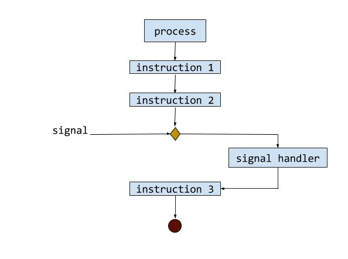

 

# minitalk

 

## Project Information

### About

The purpose of this project is to code a small data exchange program using *UNIX signals*.

 

### Mandatory

- Produce `server` & `client` executables
- `client` must communicate a string passed as a parameter to `server` *(referenced by its process ID)* which then displays it
- Use `SIGUSR1` & `SIGUSR2` signals **ONLY**

 

### Bonus

- Add reception acknowledgement system
- Support Unicode characters

 

### Allowed Functions

- [`malloc`](https://man7.org/linux/man-pages/man3/free.3.html)
- [`free`](https://man7.org/linux/man-pages/man3/free.3.html)
- [`write`](https://man7.org/linux/man-pages/man2/write.2.html)
- [`getpid`](https://man7.org/linux/man-pages/man2/getpid.2.html)
- [`signal`](https://man7.org/linux/man-pages/man2/signal.2.html)
- [`sigemptyset & sigaddset`](https://man7.org/linux/man-pages/man3/sigsetops.3.html)
- [`sigaction`](https://man7.org/linux/man-pages/man2/sigaction.2.html)
- [`pause`](https://man7.org/linux/man-pages/man2/pause.2.html)
- [`kill`](https://man7.org/linux/man-pages/man2/kill.2.html)
- [`sleep`](https://man7.org/linux/man-pages/man3/sleep.3.html)
- [`usleep`](https://man7.org/linux/man-pages/man3/usleep.3.html)
- [`exit`](https://man7.org/linux/man-pages/man3/exit.3.html)

 

### Compilation

1. Clone repo
2. Compile files with writing `make`.

 

### Mendatory Part
This project is to create a communication program in the form of a client and a server.
- The server must be started first. After its launch, it has to print its PID.
-  The client takes two parameters:
	- The server PID.
	- The string to send.
- The client must send the string passed as a parameter to the server. Once the string has been received, the server must print it.
- The server has to display the string pretty quickly. (1 second for displaying 100 characters is way too much!)
- The server should be able to receive strings from several clients in a row without needing to restart.
- The communication between the client and the server has to be done only using UNIX signals.
- UNIX signals are limited to these two signals: SIGUSR1 and SIGUSR2.

 

### Bonus Part
- The server acknowledges every message received by sending back a signal to the client.
- The program must handle unicode characters.

 

### Technologies
* C
* Makefile
* UNIX signals

 

### Resources

Manual, ressources and stuff.
* [signals manual](https://man7.org/linux/man-pages/man7/signal.7.html)
* [SIGUSR1 & SIGUSR2](https://www.gnu.org/software/libc/manual/html_node/Miscellaneous-Signals.html)
* [Introduction to UNIX Signals](http://www.cs.kent.edu/~ruttan/sysprog/lectures/signals.html)
* [😏😏😏](https://www.youtube.com/watch?v=dQw4w9WgXcQ)
* [sigaction](https://man7.org/linux/man-pages/man2/sigaction.2.html)
* [UNIX SIGNALS](http://www.math.stonybrook.edu/~ccc/dfc/dfc/signals.html)

 

## Demo

